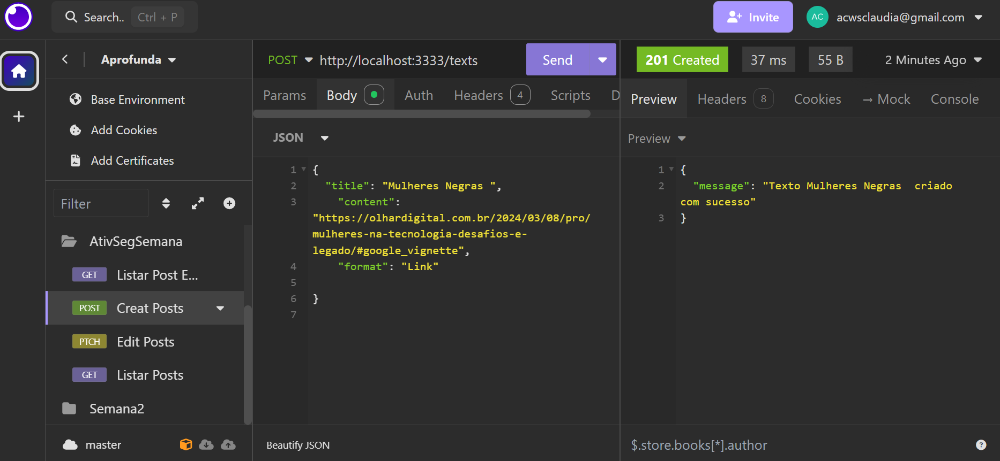
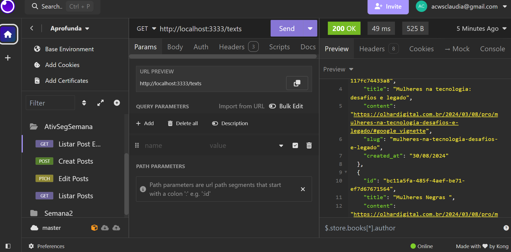
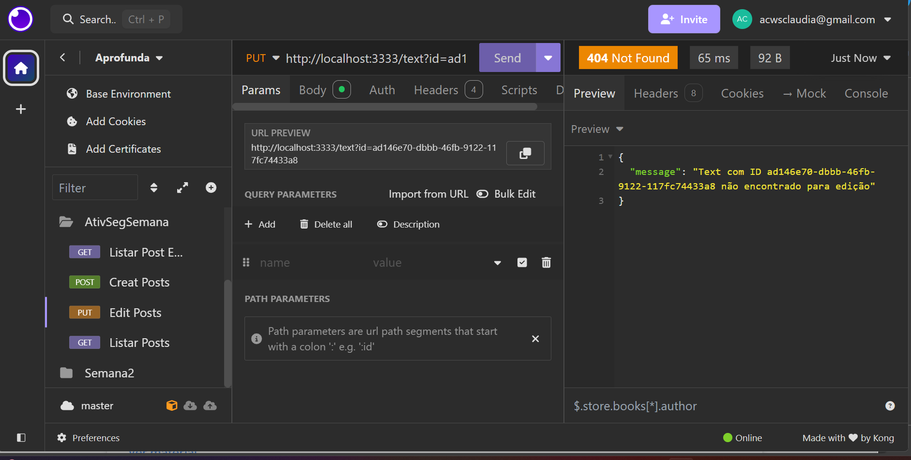

# Projeto Guiado - NodeJS
## Projeto
-----
## `Refatorar api`

> Neste projeto podemos aplicar  refatoração de uma API, durante o módulo de Design Patterns em NodeJS do projeto APROFUNDA | PretaLab.
 

#### Conteúdos aplicados:

* Instalaçao de dependências
* Estruturação das pastas
* Criação de rotas
* Utilização dos métodos http: GET, POST, PUT/PATCH, DELETE
* Utilização dos objetos Req e Res
* Ferramenta Insomnia para testar as APIs 

  

## Propósito
---

Reestruturar uma API, utilizando Design Pantterns em NodeJs, deixando o código mais organizado.

  

### `Ferramentas usadas`

 

| `nodemon` | ferramenta para reiniciar automaticamente o servidor|

| `express` | framework que roda sobre o ambiente node.js em tempo de execução|

| `npm` | gerenciador de pacotes|

| `cors` |  é um mecanismo que permita que um aplicativo Web seja executado, usando cabeçalhos HTTP|

| `slug` | é uma parte da URL que identifica e descreve o conteúdo de uma página específica|

| `uuid` | é um identificador único de 128 bits, gerado de forma aleatória|

| `Insomnia` | É uma ferramenta cliente de API REST|

  

### `Testar a API`
 
Para testar as rotas, foi utilizado a ferramenta INSOMNIA :

- POST

- DELETE

- GET

- GET BY ID

- PATCH

